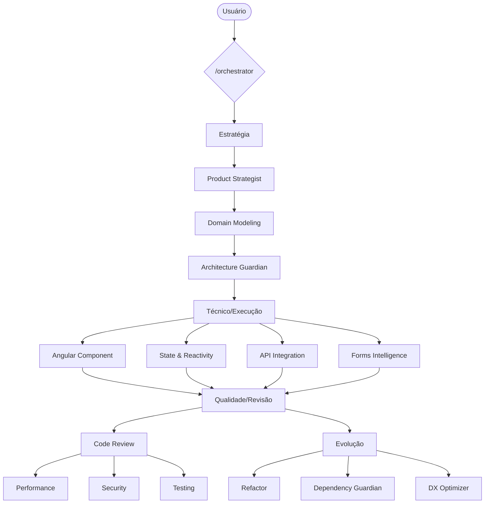

# AI Angular Software Factory — Sistema de Agentes

Ecossistema autônomo de 15 agentes especializados para desenvolvimento Angular 19+ com Standalone, Signals e Feature-Sliced Architecture — guiados por **Clean Code**, **SOLID** e **Componentização** como padrões de desenvolvimento inegociáveis.

> 📏 Todos os agentes seguem os padrões definidos em [`00-dev-standards/DEV_STANDARDS.md`](00-dev-standards/DEV_STANDARDS.md).

---

## 🗂️ Índice de Agentes

### 🧠 Camada Estratégica
| # | Agente | Responsabilidade Principal | Documentação | Ativação |
|---|---|---|---|---|
| 01 | **Product Strategist** | Refina requisitos, backlog BDD | [AGENT.md](01-product-strategist/AGENT.md) | `/product_strategist` |
| 02 | **Domain Modeling** | Entidades e contratos de API | [AGENT.md](02-domain-modeling/AGENT.md) | `/domain_modeling` |
| 03 | **Architecture Guardian** | Estrutura de pastas e padrões | [AGENT.md](03-architecture-guardian/AGENT.md) | `/architecture_guardian` |

### ⚙️ Camada Técnica
| # | Agente | Responsabilidade Principal | Documentação | Ativação |
|---|---|---|---|---|
| 04 | **Angular Component** | Componentes Standalone e Signals | [AGENT.md](04-angular-component/AGENT.md) | `/angular_component` |
| 05 | **State & Reactivity** | Feature Stores com Signals | [AGENT.md](05-state-reactivity/AGENT.md) | `/state_reactivity` |
| 06 | **API Integration** | Services HTTP e Interceptors | [AGENT.md](06-api-integration/AGENT.md) | `/api_integration` |
| 07 | **Forms Intelligence** | Reactive Forms e Validações | [AGENT.md](07-forms-intelligence/AGENT.md) | `/forms_intelligence` |

### 🔍 Camada de Qualidade
| # | Agente | Responsabilidade Principal | Documentação | Ativação |
|---|---|---|---|---|
| 08 | **Code Review** | Anti-patterns e Veredito | [AGENT.md](08-code-review/AGENT.md) | `/code_review` |
| 09 | **Performance** | Otimização e Lazy Loading | [AGENT.md](09-performance/AGENT.md) | `/performance` |
| 10 | **Security** | Auditoria XSS e Sanitização | [AGENT.md](10-security/AGENT.md) | `/security` |
| 11 | **Testing**| Unit tests e Mocks | [AGENT.md](11-testing/AGENT.md) | `/testing` |

### 🚀 Camada de Evolução
| # | Agente | Responsabilidade Principal | Documentação | Ativação |
|---|---|---|---|---|
| 12 | **Refactor** | Redução de Complexidade | [AGENT.md](12-refactor/AGENT.md) | `/refactor` |
| 13 | **Dependency Guardian** | Auditoria de Bloat | [AGENT.md](13-dependency-guardian/AGENT.md) | `/dependency_guardian` |
| 14 | **DX Optimizer** | Ferramental e Scripts | [AGENT.md](14-dx-optimizer/AGENT.md) | `/dx_optimizer` |

### 🎯 Agente de Controle
| # | Agente | Responsabilidade Principal | Documentação | Ativação |
|---|---|---|---|---|
| 15 | **Orchestrator** | Coordena o fluxo de trabalho | [AGENT.md](15-orchestrator/AGENT.md) | `/orchestrator` |

---

## 📏 Padrões de Desenvolvimento

Todos os agentes referenciam e aplicam os padrões centralizados em [`DEV_STANDARDS.md`](00-dev-standards/DEV_STANDARDS.md).

| Padrão | Princípios | Agentes que Aplicam |
|---|---|---|
| **Clean Code** | Nomenclatura expressiva, funções ≤20 linhas, sem magic numbers, sem lógica em templates | Todos |
| **SOLID** | SRP, OCP, LSP, ISP, DIP aplicados a componentes, services, stores e interfaces | 02, 03, 04, 05, 06, 08, 11, 12 |
| **Componentização** | Smart/Dumb, props drilling ≤2 níveis, extração de sub-componentes > 150 linhas | 03, 04, 08, 12 |

---

## 🔄 Sequência de Ativação Obrigatória

---

## 📐 Baseline Técnico

| Dimensão | Padrão |
|---|---|
| **Angular** | 19+ |
| **Arquitetura** | Standalone Components |
| **Reatividade** | Angular Signals |
| **Estilo** | SCSS + BEM |
| **Estrutura** | Feature-Sliced Design |
| **Clean Code** | Funções ≤20 linhas, nomes expressivos, sem magic numbers |
| **SOLID** | SRP, OCP, LSP, ISP, DIP — obrigatórios em todos os artefatos |
| **Componentização** | Smart/Dumb, extração de sub-componentes, props drilling ≤2 níveis |
| **Idioma** | Português (Brasil) |

---

## 🚀 Como usar

1. Use o comando `/orchestrator` para iniciar o fluxo.
2. Siga as instruções de cada agente.
3. Use os comandos individuais (ex: `/code_review`) para ativação pontual.
